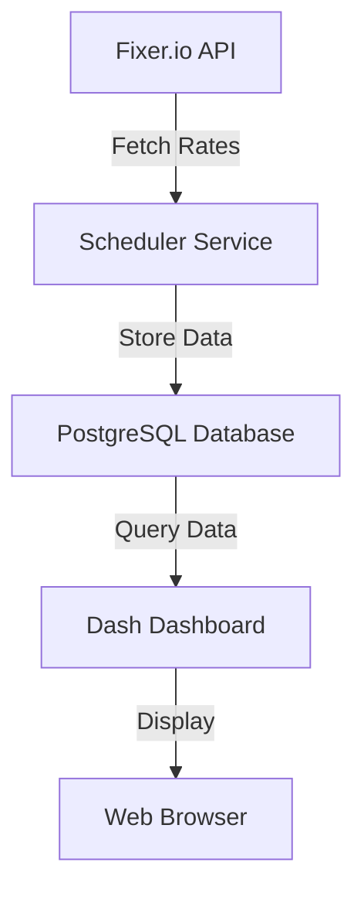
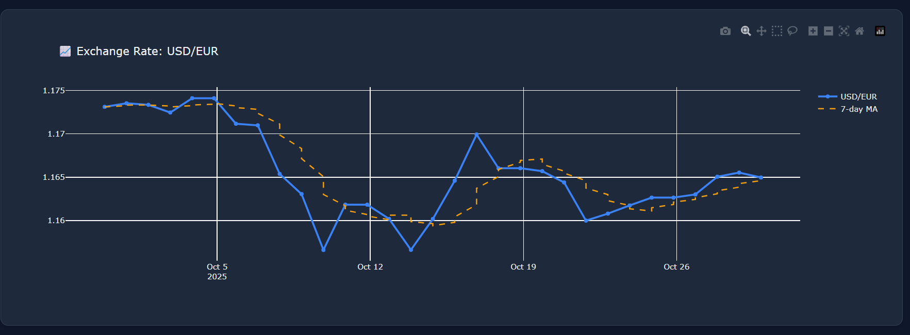
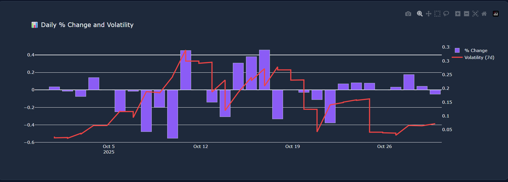

A real-time foreign exchange rate monitoring dashboard that fetches data from Fixer.io API and visualizes currency exchange rates.

# FX Rate Dashboard


## Features

* Real-time FX rate monitoring for core currencies:

  * GBP - British Pound Sterling
  * USD - United States Dollar
  * EUR - Euro
  * JPY - Japanese Yen
* Historical rate comparison with selectable date ranges
* Percentage change and volatility insights
* PostgreSQL-based historical storage for trend analysis

---

## Architecture



**Key components:**

* **Fixer.io API** – Provides the latest FX rates.
* **Scheduler Service** – Periodically fetches and cleans the data.
* **PostgreSQL Database** – Stores timestamped FX rates and enables historical analysis.
* **Dash Dashboard** – Displays interactive charts, trends, and computed metrics.
* **Web Browser** – Used to explore and interact with the dashboard.

---

## Visualization Logic

### 1. **Percentage Change Calculation**

To measure how much a currency moved relative to its previous value:

$$\text{Percentage Change} = \frac{\text{Current Rate} - \text{Previous Rate}}{\text{Previous Rate}} \times 100$$


* **Positive values** indicate appreciation.
* **Negative values** indicate depreciation.
* Used for short-term performance comparison between currencies.

These changes are visualized using **bar charts** or **colored markers** on time-series plots to quickly identify gainers or losers.

### 2. **Volatility Analysis**

Volatility is computed as the **rolling standard deviation** of exchange rate returns:

$$\text{Volatility} = \sqrt{\frac{1}{N} \sum (r_i - \bar{r})^2}$$

where (r_i) is the rate of return and (N) is the window size.
This metric captures how “stable” or “risky” a currency has been over a chosen time frame.

---

## Prerequisites

* Python 3.11
* PostgreSQL
* Fixer.io API key
* Dependencies in `requirements.txt`

---

## Installation

```bash
git clone https://github.com/MdSufiyan005/Data-Engineering-Mini-Project.git
uv venv
.venv\Scripts\activate  # Windows
uv pip install -r requirements.txt
uv pip install -e .
```

Create a `.env` file:

```env
FIXER_API_KEY=your_api_key
DB_NAME=fx_rates_db
DB_USER=postgres
DB_PASSWORD=your_password
DB_HOST=localhost
DB_PORT=5432
UPDATE_INTERVAL=60
DASH_PORT=8050
DASH_DEBUG=True
```

---

## Usage

```bash
uv run main.py
```

Access the dashboard at:
`http://localhost:8050`

---

## Dashboard Previews




---

## Project Structure

```
├── main.py                 # Application entry point
├── src/
│   ├── dashboard.py       # Dash dashboard implementation
│   ├── database.py        # Database operations
│   └── fixer_client.py    # API client for Fixer.io
├── utils/
│   ├── config.py          # Configuration management
│   ├── schedular.py       # Automated update scheduler
|   ├── dashboard_ui.py    # UI for the Dashboard
└── requirements.txt       # Dependencies
```

