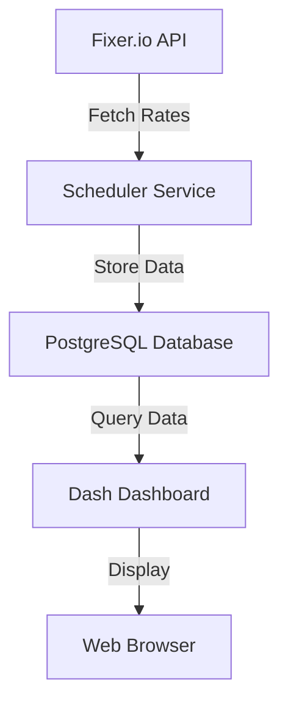
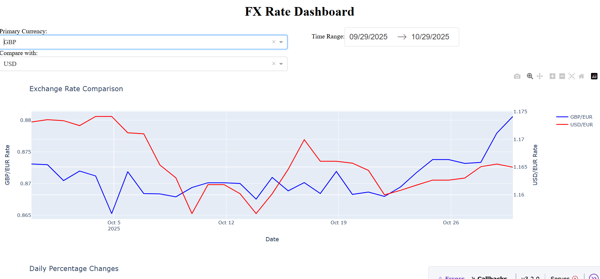
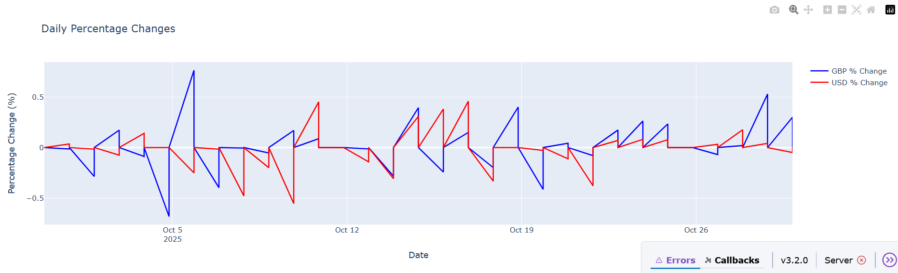

# FX Rate Dashboard

A real-time foreign exchange rate monitoring dashboard that fetches data from Fixer.io API and visualizes currency exchange rates.


## Features

- Real-time FX rate monitoring for a core set of currencies:
  - GBP - British Pound Sterling (GBP)
  - USD - United States Dollar (USD)
  - EUR - Euro (EUR)
  - JPY - Japanese Yen (JPY)
- Interactive, responsive visualizations (time-series, heatmaps, pair comparison)
- Historical rate comparison with selectable date ranges
- Multi-pair analysis and percentage-change indicators
- Automated periodic updates via a scheduler (configurable interval)
- Persistent storage in PostgreSQL for audit / historical queries
- Environment-driven configuration for easy deployment and testing

## Architecture

The service follows a simple, decoupled architecture:



Key components:

- Fixer.io API: authoritative source for FX rates.
- Scheduler Service: polls the API at UPDATE_INTERVAL and writes normalized rows to the DB.
- PostgreSQL DB: stores timestamped rate snapshots and aggregated metrics.
- Dash Dashboard: reads from DB and renders interactive charts + controls.
- Web Browser: end-user UI for visualization and exports.

Image assets referenced in this README are expected in the repository under Images/:

- Images/exchange-tab.png (dashboard overview)
- Images/dashboard1.png (currency comparison view)
- Images/dashboardpart2.png (detailed chart / controls)

Place high-resolution screenshots (1200×700 recommended) in Images/ and keep filenames exact to ensure they render correctly in this README.

## Prerequisites

- Python 3.11
- PostgreSQL database
- Fixer.io API key
- Required Python packages (see `requirements.txt`)

## Installation

1. Clone the repository:

```sh
git clone <repository-url>
cd fx-rate-dashboard
```

2. Create and activate a virtual environment:

```sh
uv init .
uv venv
.venv\Scripts\activate  # On Windows
```

3. Install dependencies:

```sh
uv pip install -r requirements.txt
```

```sh
uv pip install -e . # Forcreating pakage for ease of access across the folders.
```

4. Set up environment variables:
   Create a `.env` file with the following configuration:

```env
FIXER_API_KEY=your_api_key
DB_NAME=fx_rates_db
DB_USER=postgres
DB_PASSWORD=your_password
DB_HOST=localhost
DB_PORT=5432
UPDATE_INTERVAL=60
DASH_PORT=8050
DASH_DEBUG=True
```

## Usage

1. Initialize the database:

```sh
uv run main.py
```

2. Access the dashboard:
   Open your browser and navigate to `http://localhost:8050`

## Dashboard Features

### Currency Comparison




- Compare multiple currency pairs
- View historical exchange rates
- Analyze percentage changes

### Data Visualization

- Interactive time series plots
- Real-time rate updates
- Customizable date ranges

## Project Structure

```
├── main.py                 # Application entry point
├── src/
│   ├── dashboard.py       # Dash dashboard implementation
│   ├── database.py        # Database operations
│   └── fixer_client.py    # API client for Fixer.io
├── utils/
│   ├── clean_data.py      # Data cleaning utilities
│   ├── config.py          # Configuration management
│   └── schedular.py       # Automated update scheduler
└── requirements.txt       # Project dependencies
```

## Configuration

Key configuration options in `config.py`:

- API settings
- Database connection
- Update intervals
- Dashboard parameters
